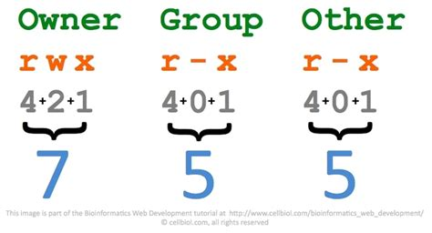

# Politica de identidad de ficheros

## comandos
* chmod: cambio de permisos
* chgrp: cambio de grupo
* chown: cambio de propietario

## Tipos de identidad

1. propietario
2. grupo
3. sistema

A cada uno de estos tipos de identidad se le pueden agregar algunos permiso

* r lectura(valor permiso 4)
* w escritura(valor permiso 2)
* x ejecucion(valor permiso 1)
	* - (valor permiso 0)

## Cambio de valores en los permisos

